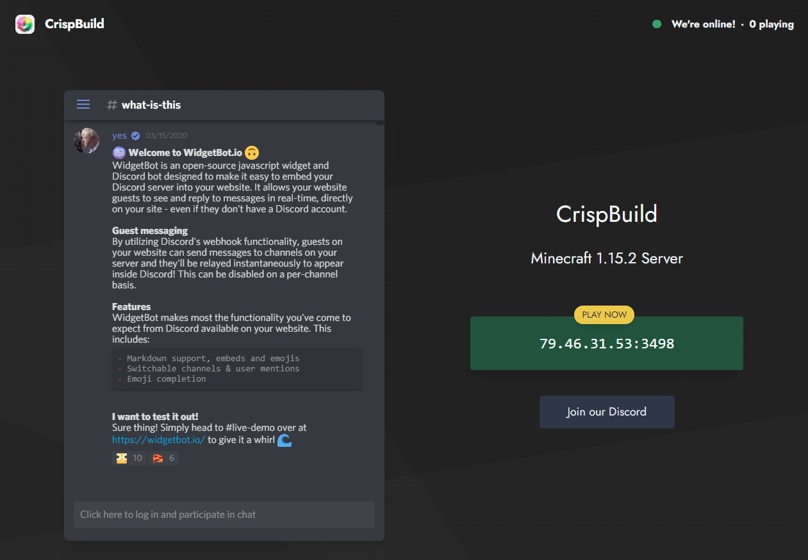

 

# Moonrise

A simple, lightweight, responsive landing page template for a Minecraft server. Integrates with Discord, Minecraft server status, and GitHub Pages to host a free website.

Features:
- Shows the server's Minecraft Java version automatically
- Shows a channel from your Discord server on the homepage
- Changes color when Minecraft server is detected to be offline
- Click to copy server IP
- Screenshots modal popup (coming soon)
- Progressive Web App (coming soon)

 

Demo: https://coffeebank.github.io/moonrise

## Getting Started

**Simple:**

The quickest way to get up and running is to use GitHub Pages (free).

1. Click "Fork" on the top right corner
1. Invite [Widgetbot](https://widgetbot.io) into your Discord server, and [get your Server ID and Channel ID](https://www.youtube.com/watch?v=6dqYctHmazc) to show on your website
1. `docs` folder: edit `_config.yml` with your information
1. `docs` folder: edit `index.md` with your own images and links

Finally, you're ready to publish your site:
1. Click the "Settings" tab
1. Change the `Repository name` to the website link you want
1. On the left sidebar, click "Pages"
  - Source: `master` branch, `/docs` folder, click "Save"

And you're done! Your website will be live at: `<username>.github.io/<repositoryname>`

**Customizing Further:**
- `docs/media` folder: [replace `favicon.ico`, `apple-touch-...`, and the two `android-chrome-...`](https://favicon.io/favicon-converter/) with [your own logo](https://unsplash.com)
- `docs` folder: [update `_config.yml`](docs/_config.yml) with siteNav links to use extra pages
- [Get a free custom domain](https://js.org), [set a custom domain](https://help.github.com/en/github/working-with-github-pages/about-custom-domains-and-github-pages) or [download to selfhost](https://github.com/coffeebank/moonrise/releases)

## License

See [LICENSE](LICENSE.md)

## Contributing

Code cleanup is welcome! Feel free to fork the project and make improvements.

## Attributions

#### Services
- https://api.mcsrvstat.us/
- https://widgetbot.io/

#### Assets
- https://clipboardjs.com/
- https://fonts.google.com/specimen/Jost
- https://github.com/penibelst/jekyll-compress-html
- https://www.gradientmagic.com/
- https://jekyllrb.com/
- https://tailwindcss.com/
- https://serviceworke.rs/
- http://updateyourfooter.com/

#### Demo
- https://favicon.io/favicon-converter/
- https://pages.github.com/
- https://unsplash.com/photos/d9medcknvk4
- https://unsplash.com/photos/52gEprMkp7M
- https://unsplash.com/photos/lS2HIgvF-80
- https://unsplash.com/photos/ZVprbBmT8QA

#### Inspiration
- https://www.tjvantoll.com/2015/09/13/fetch-and-errors/
- https://www.w3schools.com/howto/howto_css_animate_buttons.asp
- https://www.w3schools.com/howto/howto_js_snackbar.asp
